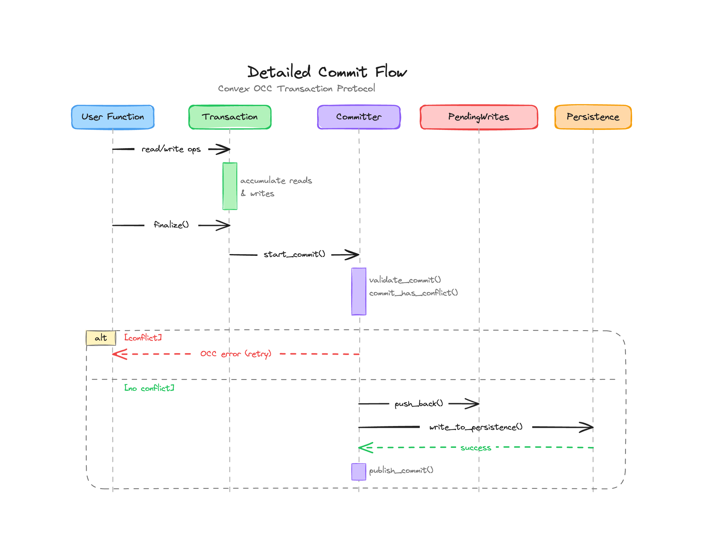

# How Convex Works

Notes from [How Convex Works](https://stack.convex.dev/how-convex-works) by Sujay Jayakar, mapped to the codebase.

---

## Overview

Convex is a database running in the cloud that executes client-defined API functions as transactions directly within the database.
The frontend connects to a Convex deployment over a persistent WebSocket.

A Convex deployment has three main components: the sync worker, the function runner, and the database.
The sync worker manages WebSocket sessions and tracks each client's active query set.
The function runner executes user-defined functions inside V8 isolates and caches their results.
The database owns the schema, tables, indexes, the committer, the transaction log, and subscriptions.

| Component | Crate | Key files |
|-----------|-------|-----------|
| Sync Worker | `crates/sync/` | `worker.rs`, `state.rs` |
| Function Runner | `crates/function_runner/` | `server.rs`, `in_memory_indexes.rs` |
| Function Cache | `crates/application/` | `cache/mod.rs` |
| V8 / Isolate Runtime | `crates/isolate/` | `isolate_worker.rs`, `isolate2/runner.rs` |
| Database | `crates/database/` | `database.rs`, `lib.rs` |
| Committer | `crates/database/` | `committer.rs` |
| Transaction Log | `crates/database/` | `write_log.rs`, `snapshot_manager.rs` |
| Subscriptions | `crates/database/` | `subscription.rs` |
| Transactions | `crates/database/` | `transaction.rs`, `reads.rs`, `writes.rs` |
| Indexes | `crates/database/` | `transaction_index.rs`, `index_workers/` |
| Local Backend | `crates/local_backend/` | `lib.rs` |
| Application | `crates/application/` | `lib.rs`, `application_function_runner/mod.rs` |

---

## Functions

There are three function types: queries (read-only), mutations (read-write), and actions (side effects allowed).
Queries and mutations run as transactions within the database.
Code is bundled and pushed to Convex on deploy.

The UDF environment is set up in `crates/isolate/src/environment/udf/mod.rs`.
Actions have a separate environment at `crates/isolate/src/environment/action/`.
The syscall interface that provides controlled access to the database lives in `crates/isolate/src/environment/udf/syscall.rs`.

## Transaction Log

The transaction log is an append-only data structure storing all versions of every document.
Each document revision carries a monotonically increasing timestamp that serves as its version number.
All tables share the same timestamp sequence, and multiple changes at the same timestamp apply atomically.

Each timestamp *t* defines a database snapshot containing all revisions up to *t*.

Timestamps are Hybrid Logical Clocks, represented as nanoseconds since the Unix epoch in a 64-bit integer (`crates/common/src/types/timestamp.rs`).
The write log holds the in-memory portion of the transaction log (`crates/database/src/write_log.rs`).
The snapshot manager provides views of the database at different timestamps (`crates/database/src/snapshot_manager.rs`).
The persistence layer handles durable storage (`crates/common/src/persistence.rs`).

## Indexes

Indexes are built on top of the log, mapping each `_id` to its latest value.
They use standard multiversion concurrency control (MVCC) techniques so the index can be queried at any past timestamp.
The system does not store many copies of each value -- see [CMU's Advanced DB Systems](https://www.cs.cmu.edu/~15721-f25/schedule.html) for background on MVCC implementation strategies.

Transaction-level index access is in `crates/database/src/transaction_index.rs`.
The function runner maintains in-memory indexes in `crates/function_runner/src/in_memory_indexes.rs`.
Index metadata and bootstrap logic live in `crates/common/src/bootstrap_model/index/`.

---

## Transactions and Optimistic Concurrency Control

All transactions are serializable.
Their behavior is identical to sequential execution.
Convex implements this via optimistic concurrency control: assume conflicts are rare, record reads and writes during execution, then check for conflicts at commit time.

Each transaction carries three ingredients.
The begin timestamp selects the database snapshot used for all reads.
The read set precisely records every index range the transaction scanned.
The write set maps each document ID to the new value proposed by the transaction.

The `Transaction` struct lives in `crates/database/src/transaction.rs`.
Read set tracking is in `crates/database/src/reads.rs`.
Write set accumulation is in `crates/database/src/writes.rs`.
The `Token` type captures the transaction's position for validation (`crates/database/src/token.rs`).

## Commit Protocol

The committer is the sole writer to the transaction log.
It receives finalized transactions, decides whether they are safe to commit, and appends their write sets.

The protocol works as follows.
First, a commit timestamp is assigned that is larger than all previously committed transactions.
Then serializability is checked by asking: would this transaction have produced the exact same outcome if it had executed at the commit timestamp instead of the begin timestamp?
To answer this, the committer walks all writes between the begin and commit timestamps and checks for overlap with the transaction's read set.
If no overlap exists, the write set is appended to the log.
If overlap is found, the transaction is aborted and the function runner retries at a new begin timestamp past the conflict.

This design is similar to FoundationDB's and Aria's commit protocols.

The committer implementation is in `crates/database/src/committer.rs`.
The database-level commit entry point is in `crates/database/src/database.rs`.

### Detailed Commit Flow

Transactions do not write to the transaction log immediately.
Instead, they collect reads and writes locally, then submit the finalized transaction to the committer for validation.

During execution, `Transaction` accumulates reads into `TransactionReadSet` and writes into `Writes` (an `OrdSet<Update>`).
On completion, the transaction is finalized into a `FinalTransaction` containing both sets.
`Committer::start_commit()` receives the `FinalTransaction` and calls `validate_commit()`.

The validation step assigns a commit timestamp and calls `commit_has_conflict()`.
This method checks the read set against two sources: already-published writes in `LogWriter` and staged-but-not-yet-published writes in `PendingWrites`.
Checking both sources prevents two concurrent transactions from both passing validation against published state while conflicting with each other.

The conflict check window is `(begin_timestamp, commit_ts]`.
For each write in that window, `ReadSet::writes_overlap_docs()` checks whether the written document's index keys fall within any interval the transaction read.

If no conflict is found, the commit is staged in `PendingWrites`, then `write_to_persistence()` durably writes it, and finally `publish_commit()` pops it from pending, appends to the write log, and updates the snapshot manager.
If a conflict is detected, an OCC error is returned and the function runner retries at a new begin timestamp.

| Component | File | Key struct / method |
|-----------|------|---------------------|
| Write accumulation | `writes.rs` | `Writes::update()` |
| Read tracking | `reads.rs` | `ReadSet`, `TransactionReadSet` |
| Transaction | `transaction.rs` | `Transaction` -> `FinalTransaction` |
| Commit validation | `committer.rs` | `Committer::validate_commit()` |
| Conflict detection | `reads.rs` | `ReadSet::writes_overlap_docs()` |
| Pending staging | `write_log.rs` | `PendingWrites::push_back()`, `is_stale()` |
| Persistence write | `committer.rs` | `write_to_persistence()` |
| Publish | `committer.rs` | `publish_commit()` |

All files under `crates/database/src/`.

## Subscriptions

Read sets also power realtime updates.
After running a query, the system keeps its read set in the client's WebSocket session within the sync worker.
When new entries appear in the transaction log, the same overlap-detection algorithm determines whether the query result might have changed.

The subscription manager aggregates all client sessions, walks the transaction log once, and efficiently identifies which subscriptions are invalidated.

The subscription manager lives in `crates/database/src/subscription.rs`.
Local backend subscription handling is in `crates/local_backend/src/subs/mod.rs`.
The sync worker that manages WebSocket sessions and query sets is in `crates/sync/src/worker.rs`.

## Function Cache

Serving a cached result from memory is much faster than spinning up a V8 isolate.
Convex automatically caches queries, and the cache is always fully consistent.
It uses the same overlap-detection algorithm as the subscription manager to determine whether a cached result's read set is still valid at a given timestamp.

The cache implementation is in `crates/application/src/cache/mod.rs`.

## Sandboxing and Determinism

Mutations must have no external side effects, which is enforced through sandboxing.
Queries must be fully determined by their arguments and database reads.
These constraints enable safe retries and precise subscriptions.

The isolate sandbox environment is in `crates/isolate/src/environment/udf/mod.rs`.
Determinism checks are in `crates/isolate/src/request_scope.rs`.
The syscall provider that serves as the controlled interface to the database is in `crates/isolate/src/environment/udf/syscall.rs`.
Deterministic crypto RNG seeding is in `crates/isolate/src/environment/crypto_rng.rs`.

---

## Not Covered Here

Actions, auth, end-to-end type-safety, file storage, virtual system tables, scheduling, crons, import/export, text search and vector search indexes, pagination, and more.
